# LeYu-awa

---

## Profile

I build product-oriented software with a focus on clean interfaces, local-first desktop experiences, and AI-assisted creation tools. My work mainly explores the intersection of frontend engineering, Tauri/Rust desktop apps, Canvas animation, and agent-style automation.

- Currently focused on **Tauri 2 + React + TypeScript** desktop products.
- Interested in **AI-assisted writing, 2D character animation, and developer tooling**.
- Prefer building small but complete products with polished UI and practical workflows.

---

---

## What I Use

  
   
  
   
  
   
  
   
  
   
  
   
  
   
  

---

<strong>Designing useful tools. Shipping complete experiences.</strong>

